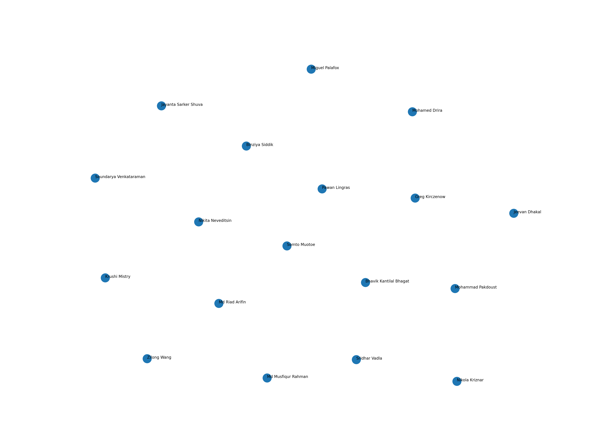

# Matchmaking Using NLP Embeddings

This project explores how sentence embeddings and dimensionality reduction can be used to model similarity between classmates based on short text descriptions of their interests.

The pipeline consists of:

- **Data** – Text descriptions from classmates.csv

- **Embedding Model** – SentenceTransformer models

- **Dimension Reduction** – UMAP for visualization

## 👥 Team Contributions

This project was completed collaboratively by:

- **Mohammad Pakdoust**

- **Musfiqur Rahman**

- **Krushi Mistry**

## Contribution Breakdown

### Mohammad Pakdoust

- Created and structured the main branch

- Implemented and documented Question 1 (What Are Embeddings?)

- Conducted and analyzed Question 2 (Data Sensitivity)

- Implemented Question 5

- Wrote and finalized the README

### Krushi Mistry

- Implemented and analyzed Question 3 (Model Comparison)

### Musfiqur Rahman

- Implemented and analyzed Question 4 (Dimension Reduction / UMAP Analysis)

**All team members reviewed and validated the final repository before submission.**

## Sample Visualization

Below is the similarity visualization generated using UMAP and sentence embeddings:

  

## What Are Embeddings?

Imagine asking a computer to understand what people like to do — for example:

“I enjoy trail running and surfing.”

“I love hiking and swimming.”

“I prefer reading and indoor activities.”

Computers do not naturally understand meaning the way humans do. To help them, we use embeddings.

An embedding is a way of turning a sentence into a long list of numbers that captures its meaning. You don’t need to understand the math behind it — just think of it like assigning each sentence a unique “meaning fingerprint.” Sentences that talk about similar things (like hiking and running) end up with similar fingerprints. Sentences about very different topics (like sports vs. reading) end up far apart.

For example:

“Swim, bike, run”

“I like hiking and swimming”

These sentences are different, but they share outdoor and physical activity themes. The embedding model detects this similarity and places them close together in meaning space.

We then use dimension reduction (UMAP) to compress these large meaning fingerprints into 2D so we can visualize relationships between classmates.

## Q2 – Data Analysis

To understand how sensitive embeddings are to changes in data, we modified three sentences in classmates.csv.

### We applied:

- One major semantic change (changing a sentence to something conceptually different)

- One minor wording change (rephrasing without changing meaning)

- One moderate synonym swap

- We regenerated embeddings and compared them to the original ones using cosine similarity.

### Results

- Minor wording changes resulted in high similarity scores, meaning embeddings were stable.

- Synonym replacements caused moderate shifts, but similarity remained relatively high.

- Major semantic changes resulted in large drops in similarity, meaning the embedding model detected meaningful differences.

### Conclusion

Embeddings are robust to small wording changes but sensitive to meaningful semantic shifts. This confirms that the model captures meaning rather than exact wording.

## Q3 – Model Comparison

We compared two embedding models:

- all-MiniLM-L6-v2

- all-mpnet-base-v2

For each model, we generated embeddings and ranked classmates by similarity for a selected anchor person.

We evaluated ranking similarity using:

Spearman Rank Correlation

### Findings

- Spearman correlation ≈ 0.39–0.68 (depending on configuration)

- Many top matches overlapped across models

- Some individuals experienced significant ranking shifts

### Interpretation

While both models capture similar global structure, they differ in fine-grained ranking decisions. This shows that model selection can meaningfully affect downstream similarity tasks.

## Q4 – Dimension Reduction (UMAP) Analysis

We analyzed how UMAP parameters and randomness impact visualization.

### Seed Sensitivity

We ran UMAP with multiple random seeds:

1

7

42

99

123

### Observation

- Global clusters remained relatively stable.

- Local positioning varied.

- Visual layouts shifted slightly across seeds.

- This shows that UMAP introduces stochastic variation, but preserves general neighborhood structure.

### Hyperparameter Tuning (Optuna)

We optimized UMAP parameters using Optuna with the objective of maximizing rank preservation (average Spearman correlation between high-dimensional and reduced-space distances).

### Best Parameters Found

n_neighbors: 8

spread: 1.77

min_dist: 0.41

metric: cosine

Best Average Spearman Correlation

≈ 0.68

### Interpretation

Proper tuning significantly improves how well the 2D visualization preserves the original similarity structure.

## Q5 – Robustness and Evaluation

We evaluated how model choices and dimension reduction parameters influence similarity relationships.

### Key observations:

Embedding model choice impacts ranking stability.

UMAP parameters strongly influence visual structure.

Cosine metric performs better for semantic embeddings.

Lower n_neighbors increases local clustering sensitivity.

Overall, both the embedding component and the dimension reduction component meaningfully influence final outputs.

### Reproducibility

Create environment (uv)

`uv venv`

`uv sync`

### Run embedding generation
`uv run python main.py`

### Run model comparison
`uv run python model_comparison.py --anchor "Mohammad Pakdoust"`

### Run UMAP seed sensitivity
`uv run python umap_seed_sensitivity.py --seeds 1 7 42 99 123`

### Run UMAP hyperparameter tuning
`uv run python umap_optuna_tuning.py --trials 20 --seed 42`

# Final Remarks

This project demonstrates how:

- Text data is transformed into numerical representations.

- Model choice affects similarity rankings.

- Dimension reduction influences visual interpretation.

- Hyperparameter tuning improves structural preservation.

By systematically analyzing data sensitivity, model variation, and UMAP configuration, we better understand how each component impacts the final matchmaking visualization.
