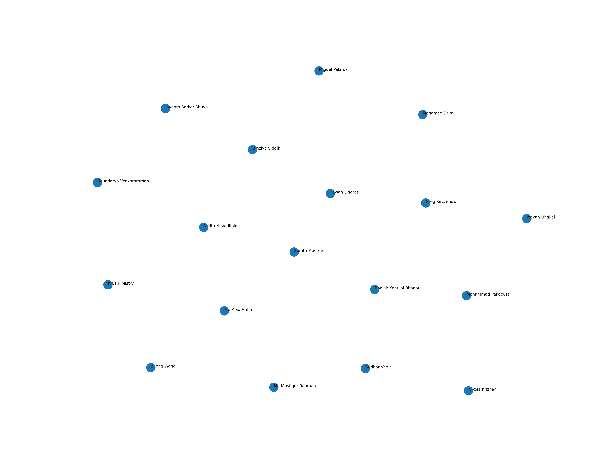

# Semantic Similarity with NLP Embeddings

A team project exploring how **sentence embeddings, similarity metrics, and dimensionality reduction** affect semantic matching.

Short text descriptions are embedded with transformer models, compared using cosine similarity, and projected into two dimensions with UMAP to study ranking stability and visualization behavior.

## Team

- Mohammad Pakdoust
- MD Musfiqur Rahman
- Krushi Mistry

### Mohammad's contributions

- Structured the main branch
- Implemented and documented the embeddings overview
- Ran the data-sensitivity analysis
- Implemented the robustness/evaluation work
- Finalized the repository documentation

## Questions explored

- How stable are sentence embeddings under small wording changes?
- How much does embedding-model choice change similarity rankings?
- How sensitive are UMAP visualizations to random seeds and parameters?
- Can tuning improve neighborhood/rank preservation?

## Pipeline

```text
Text descriptions
      ↓
SentenceTransformer embeddings
      ↓
Cosine similarity
      ↓
Model / sensitivity analysis
      ↓
UMAP
      ↓
2D visualization + robustness evaluation
```

## Models and methods

- SentenceTransformers
- `all-MiniLM-L6-v2`
- `all-mpnet-base-v2`
- Cosine similarity
- UMAP
- Spearman rank correlation
- Optuna hyperparameter tuning

## Example visualization

<p align="center">
  
</p>

## Key observations

- Small wording changes generally preserved high semantic similarity.
- Larger semantic changes caused much larger embedding shifts.
- Different embedding models produced overlapping but non-identical rankings.
- UMAP preserved broad structure while local placement varied with seeds and parameters.
- Hyperparameter choices materially affected how well the 2D layout preserved high-dimensional relationships.

## Reproducibility

Create the environment:

```bash
uv venv
uv sync
```

Generate embeddings:

```bash
uv run python main.py
```

Compare embedding models:

```bash
uv run python model_comparison.py --anchor "Mohammad Pakdoust"
```

Test UMAP seed sensitivity:

```bash
uv run python umap_seed_sensitivity.py --seeds 1 7 42 99 123
```

Run UMAP tuning:

```bash
uv run python umap_optuna_tuning.py --trials 20 --seed 42
```

## Background

Developed collaboratively as part of MSc Computing & Data Analytics coursework at Saint Mary's University. The repository is kept public as an example of practical NLP experimentation, evaluation, and reproducibility.
